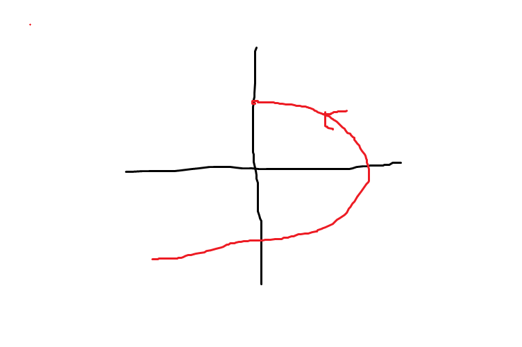

# Vector Integration
In this chapter we will talk about the facinating world of vector integration! 

Ex1: Evaluate $\int_{C} \vec{F} * d\vec{r}$

$F(x,y,z) = xy \vec{i} + yz \vec{j} + xz \vec{k}$

given $ C: x=1, y = t^2, z=t^3$

doing: 

$ \int_{c} F(x,y,z) d\vec{r} = \int xy dx + \int yz dy + \int xz dz$

$ = \int_{0}^{1} (t * t^2 dt + t^3 * t^2 * 2t dt + t*t^3*3tdt)$

and so on

----

Ex2: Evaluate $\int_{c} y^2 dx + x dx, $

Where C is the arc of the parabola

$ x=4-y^2$ from (-5,-3) to (0.2)

doing:

$ C:x=4-t^2, y=t, -3<=t<=2 $

$ dx = -2tdt, dy=dt$

$\int_{c} y^2dx+xdy = \int_{-3}^{2}(-st^3+4-t^2)dt$

$ = \int_{-3}^{2} (-2t^3 + 4 - t^2)dt$

$ = \frac{-2t^4}{4} + 4t -\frac{t^3}{3} |_{-3}^{2} $

Meh I dont wanna do it now loooool

## Parametric Equations of the Curves

| Curve C | Parametric equations of C |
|-------|--------|
|C is a line segment from (x0 , y0 , z0 ) to(x , y , z )|stuffs|

