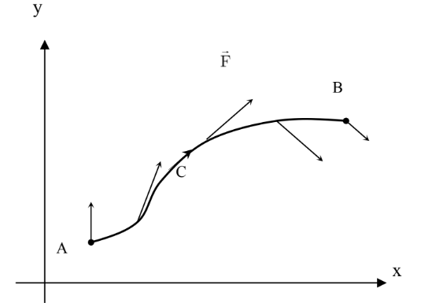
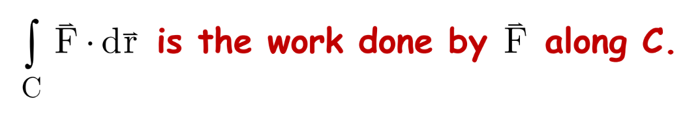
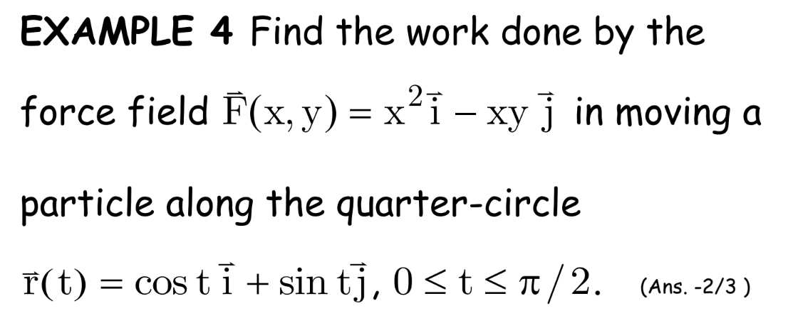

# Lecture 7

Doing:

let $D = (1,1,2)$

at the point C2:

$C_{2} : x=1+t, y=1+2t, z=2-t, 0 <= t <> 1$

and then you can find $dx, dy, dz$

Now let's do the integration

$\int_{C_{2}} \vec{F}d\vec{r} = \int{_{C_{2}}} (1+t)dt + (1+2t)2dt + (2-t)dt$

Now solve the integral.

## If $\vec{F}$ is a force field

In physics, if $\vec{F} $ is the force that used to move the object in the smooth curve like this

Then

Let's see some example:

c: $\vec{r} = cost\vec{j} + sint\vec{j}$

Therefore:

$x = cost, y = sint$

Now you can calculate for dx and dy

Work = $\int_{C} \vec{F}d\vec{r} = \int_{c} r^2dx-xydy$

= $ \int_{0}^{\pi/2} cos^2(t) (-sintdt)-costsint(costdt) $

= $- \int_{0}^{\pi/2}2cos^2(t)sin(t)dt $

And then we use the substitution technique

let $u = cos(t)$

and then you get the point.

C: $x =t, y=2t, z=5-(2t)^2=5-4t^2$

as you can see, this example we simple put the plane equation into the cylinder equation. 

= $\int_{0}^{1}((5-4t^2-4(2t))dt+4t(2dt)+e^{t(st)}dt)$

## Line Integral with Respect to Arc Length.

