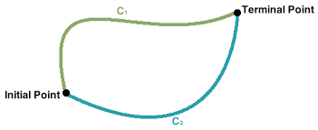
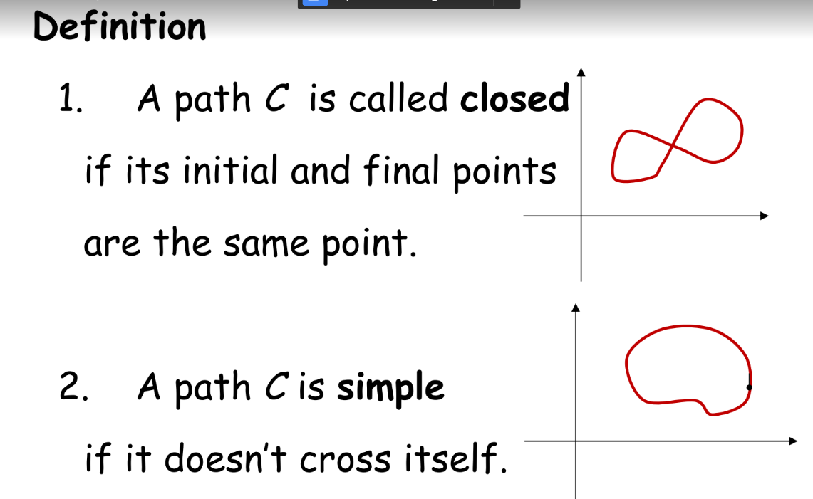
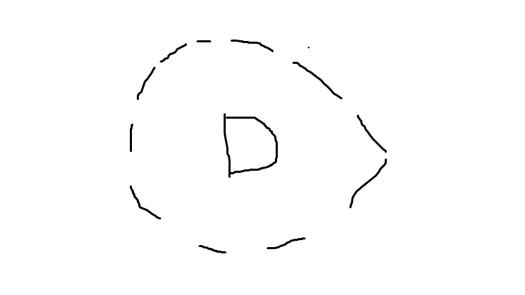
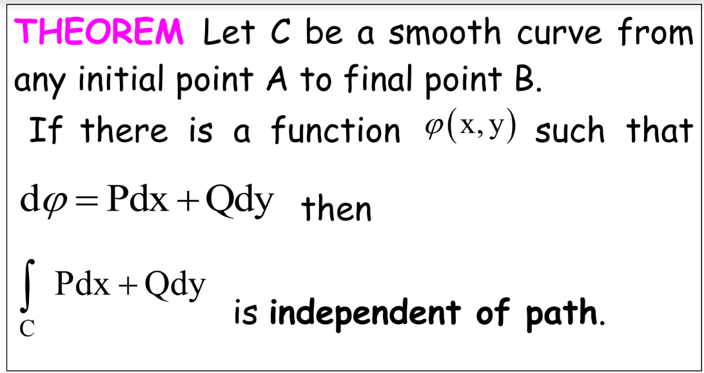

# Lecture 8 
## Independence of path

- The initial and the terminal point are the same for each path.

### Definition

3. Open

4. Connected

### Theorem

### Theorem 2
$\frac{\partial{P}}{\partial{x}} = \frac{\partial{Q}}{\partial{y}}$

### METHOD 2

Find a fuction $\phi$ that is $d\phi=Pdx+dy$

=> From $\int_c\vec{F}d\vec{r}=\phi(stuffs)$

=> Using the theorem $\frac{\partial{P}}{\partial{x}} = \frac{\partial{Q}}{\partial{y}}$

### Example 2

p = cosxcosy

Q=1-sinxsiny

$\frac{\partial{p}}{\partial{x}}=-sin(x)cos(y)$

$\frac{\partial{Q}}{\partial{y}}=-sin(x)cos(y)$

They are the same, therefore, THe line integration is independent

THIS IS A HOMEWORK AAAAAAAA

#### How to find Phi
