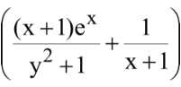

# Lecture 9

## continue of line integral

Observe that in this case, if we use line integral, it will be a an absolute nightmare.

let P = 

let Q = 

Test for independent of path

$\frac{\partial{f}}{\partial{y}}=(x+1)e^x(-(y^2+1)^{-2})2y=-(x+1)e^x\frac{2y}{(y^2+1)^2}$

$\frac{\partial{f}}{\partial{y}}=\frac{-2y}{(y^2+1)^2}(xe^x+e^x)=-(x+1)e^x\frac{2y}{(y^2+1)^2}$

Therefore the line integral is independent of path.

Solve for $\phi{(x,y)}$ from

$\frac{\partial{\phi}}{\partial{x}}=P=\frac{(x+1)e^xx}{y^2+1}+\frac{1}{x+1}$

$\frac{\partial{\phi}}{\partial{y}}=Q=sec^2(y)-\frac{2xye^x}{(y^2+1)^2}$

$\phi{(x,y)}=\int{(sec^2(y)-x)-\frac{2xye^x}{(y^2+1)^2}}$ x is a constant $\int\frac{2y}{(y^2+1)^2}dy$ ,u = $y^2+1$, du = ....

$=tan(y)+xe^x(\frac{1}{y^2+1}+g(x))$ now we take a derivative with respect to x

Now we need to find the g(x), we can do that by finding by finding $\frac{\partial{\phi}}{\partial{x}}$ and compare it to the first equation so we can get the g'(x) and then g(x).

$\frac{\partial{\phi}}{\partial{x}}=0+xe^x\frac{1}{y^2+1}+g'(x)$

//find the g(x)

now we get the complete $\phi{(x,y)}$ we can find the line integral by 

$[\phi{(x,y)}]^{B}_A$

## Green's theorem

$\oint_{C}{Pdx+Qdy}=-\int_{-C}{Pdx+Qdy}$

C = clock wise, -C = counter clock wise

$\oint{Pdx+Qdy=\int_R\int{\frac{\partial{\phi}}{\partial{x}}-\frac{\partial{\phi}}{\partial{y}}}}$

then solve the integral and that's it

$\int\int_R{(7-3)}dA=4\int\int_RdA=4(\pi{r^2})=8\pi$

You can use the area of something instead of integrating the whole thingy

Also the key answer is wrong lmao

Using green's theorem

$-\int\int_R{2-1}dA=-\int\int_Rdydx=\int^1_0\int^{\sqrt{x}}_{x^2}dydx$

Solve for the thing and you will get

$-\frac{1}{3}$ ANS
